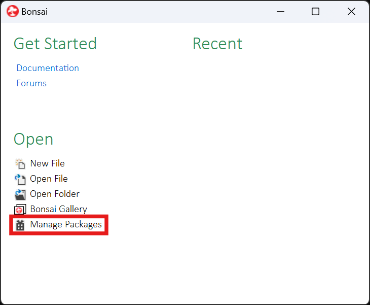
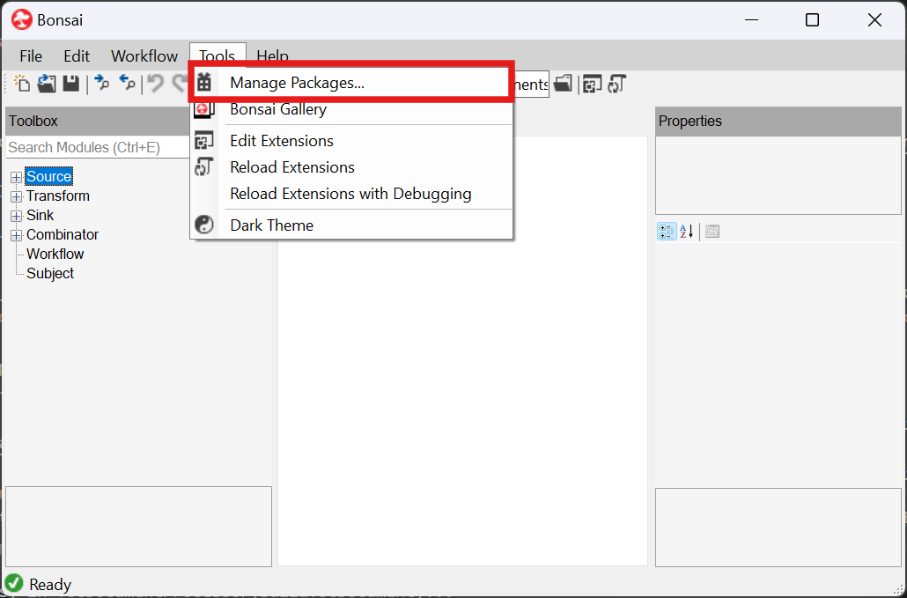
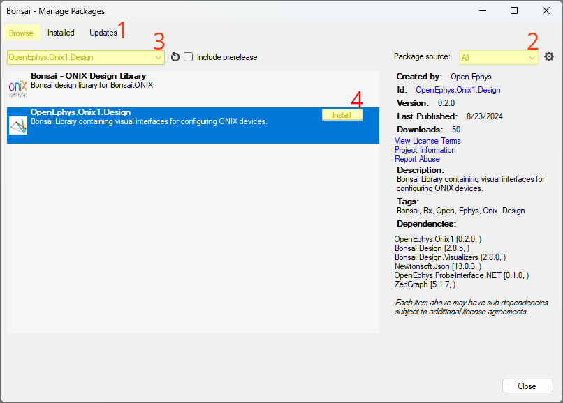
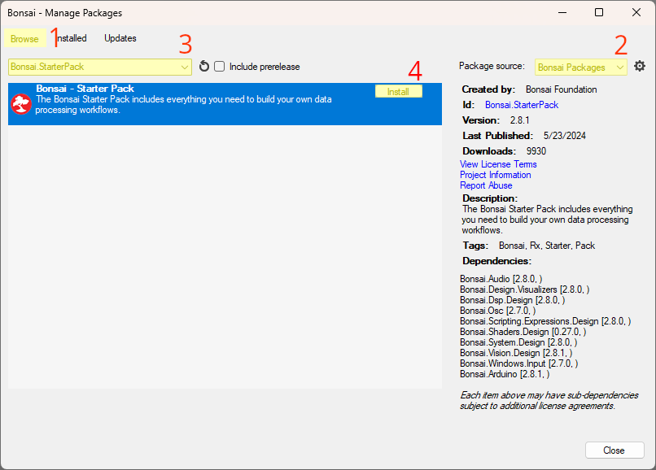
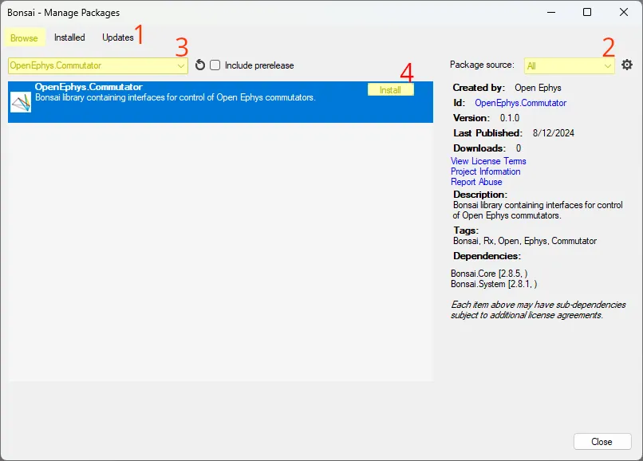
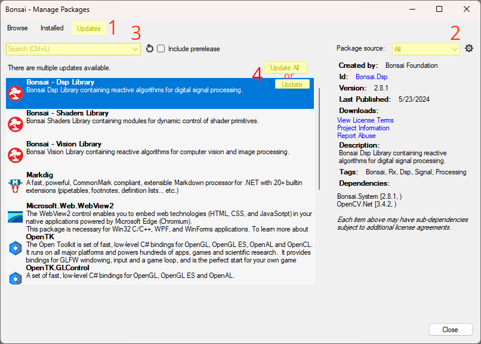
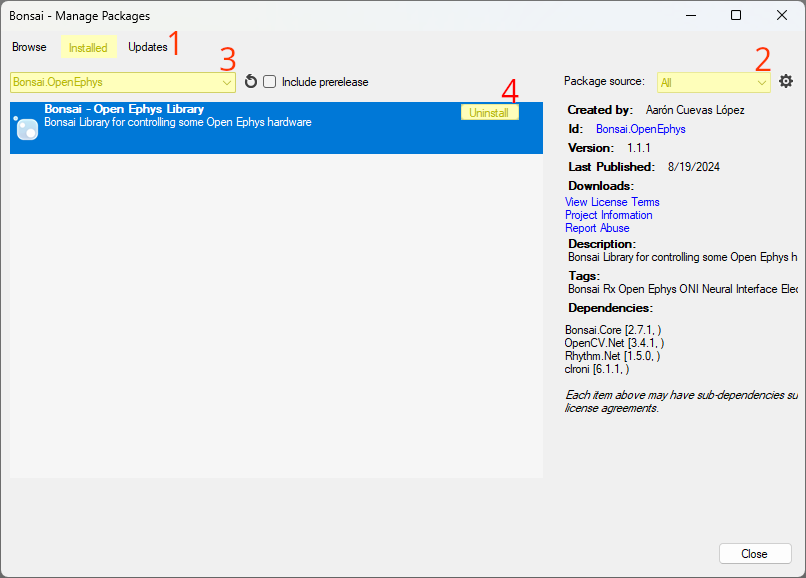

## Install Bonsai
To download Bonsai, select between the portable download and the installer download [here](https://bonsai-rx.org/docs/articles/installation.html).

*   The **Portable** download (.zip) installs a sandboxed version of Bonsai. Portable environments enable users to switch between different environments to prevent package conflicts or confusion between similar packages.
    *   To install from the **Portable** download, extract the downloaded file. You can start the portable Bonsai by running the `Bonsai.exe` that is inside the extracted folder.
*   The **Installer** download (.exe) installs Bonsai and all its dependencies globally.
    *   To install from the **Installer** download, run the downloaded `Bonsai-X.X.X.exe` file and agree to the involved licenses. You can start the globally installed Bonsai by launching it from the `Bonsai Setup` window after installing or searching for it in your OS's search function, for example. 

> [!TIP]
> When using multiple environments, create and name shortcuts such that different Bonsai environments are easier to find and distinguish. 

## Open Bonsai Package Manager
The Bonsai package manager can be accessed from Bonsai's landing window or its workflow editor:

{width=350px} or {width=425px}

## Install Packages in Bonsai
The following packages required to run the workflows in this documentation are:

* `Bonsai.StarterPack`: the "standard library" for Bonsai that contains tools that are used in almost every workflow.
* `OpenEphys.Commutator`: Bonsai package for controlling Open Ephys commutators.
* `OpenEphys.Onix1.Design`: An extension of the `OpenEphys.Onix1` library that includes graphical user interfaces (GUIs).

> [!TIP]
> Additional packages will allow you to extend the functionality of ONIX hardware beyond the scope of this documentation. There are packages that allow ONIX be combined with [visual psychophysics](https://bonsai-rx.org/docs/tutorials/vision-psychophysics.html), [markerless pose estimation](https://bonsai-rx.org/sleap/), [HARP behavioral devices](https://harp-tech.org/), and much more.

### OpenEphys.Onix1

To install the `OpenEphys.Onix1` package [open the package manager](#open-bonsai-package-manager) and:

1.  Click the `Browse` tab.
1.  Set `Package source` to `All` or `NuGet`.
1.  Search `OpenEphys.Onix1`.
1.  Click `Install`.
1.  Click `I Accept` when the license agreement window appears.

{width=650px}

### OpenEphys.Onix1.Design

To install the `OpenEphys.Onix1.Design` package [open the package manager](#open-bonsai-package-manager) and:

1.  Click the `Browse` tab.
1.  Set `Package source` to `All` or `NuGet`.
1.  Search `OpenEphys.Onix1.Design`.
1.  Click `Install`.
1.  Click `I Accept` when the license agreement window appears.

{width=650px}

### Bonsai.StarterPack

To install the `Bonsai.StarterPack` package [open the package manager](#open-bonsai-package-manager) and:

1.  Click the `Browse` tab.
1.  Set `Package source` to `Bonsai Packages`.
1.  Search for `Bonsai.StarterPack`.
1.  Click `Install`.

{width=650px}

### OpenEphys.Commutator

To install the `OpenEphys.Commutator` package [open the package manager](#open-bonsai-package-manager) and:

1.  Click the `Browse` tab.
1.  Set `Package source` to `All` or `NuGet`.
1.  Search for `OpenEphys.Commutator`.
1.  Click `Install`.

{width=650px}

## Update Packages in Bonsai

It is good practice to periodically check for package updates. To do this, [open the package manager](#open-bonsai-package-manager) and:

1.  Click the `Update` tab.
1.  Set `Package source` to `All`.
1.  Leave the search bar blank if you want to check for updates for all packages.\
    Alternatively, if you want to check for an update for a particular package, you may type that package's name in the search bar to expedite the update retrieval process.
1.  Click `Update All` if you want to perform all available updates.\
    Alternatively, click on a package and click `Update` if you want to perform a subset of the available updates.

{width=650px}

## Uninstall Packages in Bonsai

Sometimes it is helpful to uninstall packages. [Open the package manager](#open-bonsai-package-manager) and:

1.  Click the `Installed` tab.
1.  Set `Package source` to `All`.
1.  Leave the search bar blank if you want to see all installed packages.\
    Alternatively, if you want to uninstall a particular package, you may type that package's name in the search bar.
1.  Click a package and click `Uninstall` to uninstall a packages.

{width=650px}

## Next Steps

Now that Bonsai has been installed and configured, it is time to start constructing a workflow to capture data from your ONIX system. The following sections give a high-level understanding of how Bonsai is organized, and some of the ONIX-specific concepts that will be useful for learning how to work with the operators. If you are familiar with Bonsai, you might want to skip to the <xref:tutorials> section.
