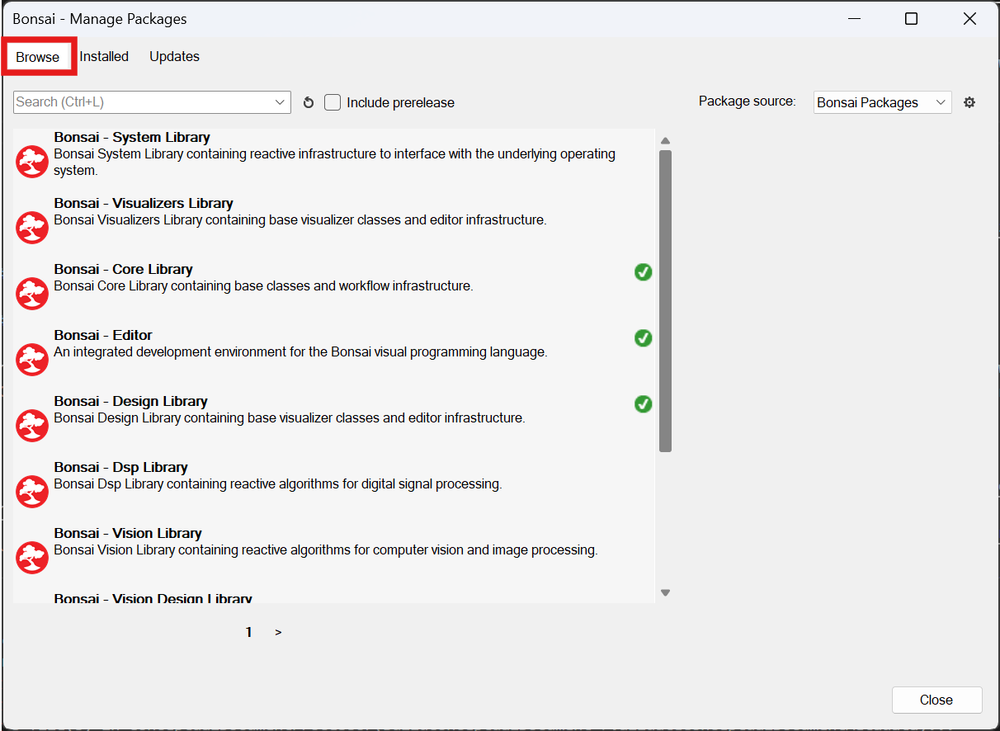
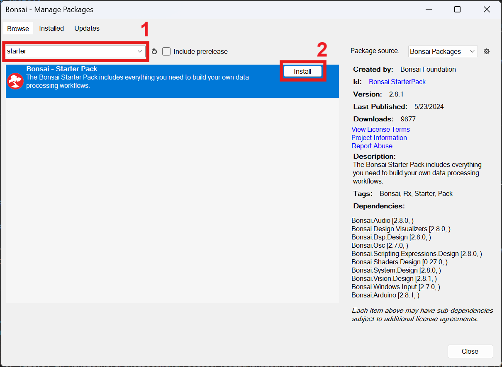
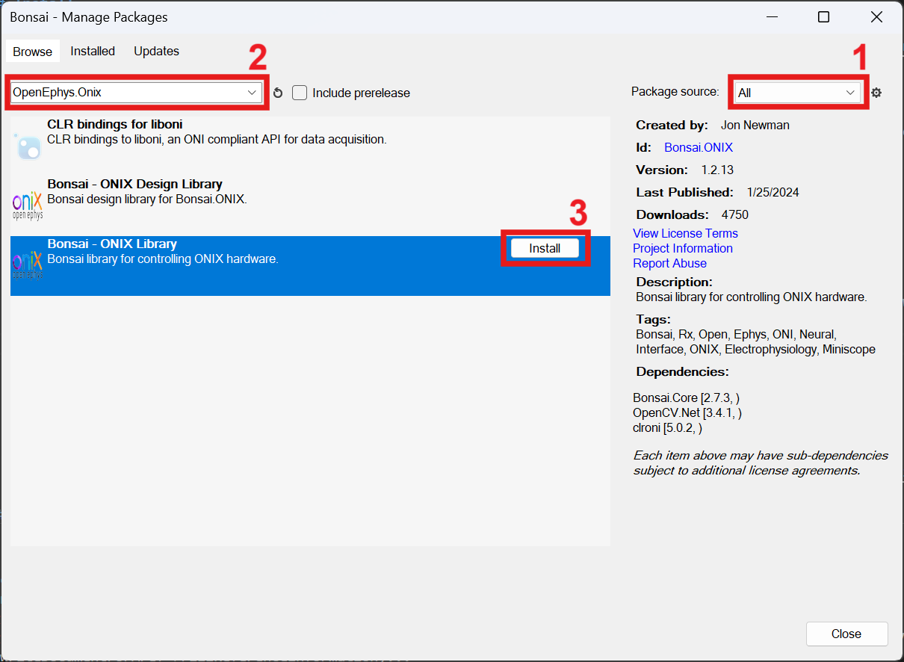

* To install `OpenEphys.Onix1`, first install Bonsai [here](https://bonsai-rx.org/docs/articles/installation.html)
* Once Bonsai is installed, open Bonsai and download the necessary packages
    * Open the Bonsai package manager
        
        {width=350px} or {width=425px}
    * Go to **Browse**
        
        {width=650px}
    * Download the `Bonsai.StarterPack`, which contains several commonly used packages that will be useful for creating workflows and visualizing data. Search for `Bonsai.StarterPack` (1), select the package and click **Install** (2). Click `I Accept` to accept the licenses.
        
        {width=650px}

    * Change the package source to **All** (1), then follow the same steps (2,3) to search for and install `OpenEphys.Onix1`

        {width=650px}

        > [!Warning]
        > Update this once the package has been published to NuGet

        > [!Note]
        > Alternatively, to take advantage of the graphical user interface built on top of Bonsai, search for the `OpenEphys.Onix.Design` package, which provides GUI's for many of the configurable nodes, making it easier to configure settings and visualize changes prior to committing them to the hardware

Now that Bonsai has been installed, and the appropriate packages downloaded, it is time to start placing nodes and configuring them. If you are new to Bonsai, the following sections give a high-level understanding of how Bonsai is organized, and some of the ONIX-specific concepts that will be useful for learning how to work with the nodes.

