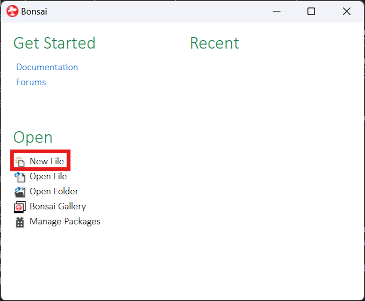

To begin, the first thing to do is to open up the Bonsai editor. This can be done by starting Bonsai and clicking on the **New File** button on the left side. Alternatively, if you have previously opened or saved a file in Bonsai, there will be a list of recently opened files on the right side; any of those can be chosen and they will be opened in the editor automatically.

{width=650px}

From the editor, nodes can be selected on the left side and placed into the workspace. Before going into details on how to place nodes, we will instead go over the different types of nodes, some examples of ONIX-specific nodes in each category, and some common categories of properties that can be modified across nodes.
