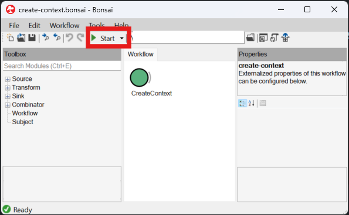

Once all nodes have been placed and linked correctly, and all **Configuration** properties have been set, it is now possible to run a workflow. Note that some aspects of Bonsai are only available in specific contexts; for instance, the GUIs mentioned above can only be opened when a workflow is not running. Once a workflow is running, these GUIs are not accessible, but visualizers for certain nodes can be opened to view the streaming data.

Running a workflow can be done in one of two ways: (1) Press the **Start** button at the top of the Bonsai editor, and (2) Press F5. Upon starting a workflow, a context will be created, and all devices will be configured based on the **Configuration** properties. Any `*Data` nodes will then begin streaming data, and can be visualized. 

{width=700px}
