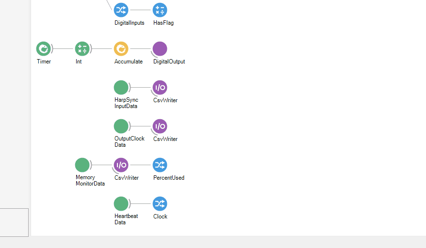

The following excerpt from the Breakout Board [example workflow](xref:breakout) demonstrates analog
IO functionality by computing a ~1Hz sawtooth pattern, outputting it to the analog IO port, and
reading it back from the analog IO port. It also saves analog inputs data.

::: workflow

:::

## Analog outputs
:::workflow

:::

The `RampGenerator` operator generates a sequence of single precision floating point values which
comprises ~1Hz sawtooth waveform from -10 to 10. The <xref:OpenEphys.Onix1.AnalogOutput> updates the
analog output port upon receiving a value in the upstream sequence. In the Breakout Board example
workflow:

- The `AnalogOutput`'s `DeviceName` property is set to "BreakoutBoard/AnalogIO". This links the
  `AnalogOutput` operator to the corresponding configuration operator. 
- The `AnalogOutput`'s `DataType` property is set to "Volts". The `RampGenerator` operator computes
  a sawtooth pattern that consists floats in units of volts, so `AnalogOutput` must be set
  to "Volts" to accept this input. Of course, the `RampGenerator` could be used to produce a
  sequence of signed 16-bit DAC codes. In that case, `DataType` property would be set to "S16".

Although a voltage ramp is sent to all the channels, only channel 0 was selected to be a output, so
this is the only channel that will be affected. If other channels are configured as output (see
<xref:breakout_configuration>), they will also ramp their voltage. The `RampGenerator` is a
[GroupWorkflow](https://bonsai-rx.org/docs/articles/editor.html#workflow) that contains multiple
Bonsai operators. Examine `RampGenerator`'s internals by pressing <kbd>Ctrl</kbd> + <kbd>Enter</kbd>
when its node is selected:

:::workflow

:::

> [!Tip]
> To understand how the <code>RampGenerator</code> works, double click each
> nodes in the workflow > while its running to visualize how data is transformed
> as it flows through each operator. Additionally, the <kdb>F1</kdb> key can be
> pressed while a node is selected ot bring up its documentation.
> <figure>
>   <video width="100%" loop="true" controls="true"><source src="../../../images/hardware/breakout/analog-io.mp4" type="video/mp4"/></video>
>   <figcaption>
>     This video shows how Bonsai how to examine the data flowing through
>     different elements of workflow as it operates. The "AnalogOutput" window
>     shows the values that are being used by the <code>AnalogOutput</code>
>     operator to update the analog IO port. 12 signals are produced, one for each
>     channel.  However, only analog channel 0 is actually updated because it's
>     the only channel configured as output by the <code>BreakoutBoard</code>
>     operator. The "AnalogData" window shows the voltages at the various pins of
>     the analog IO port. They are being read by the the ADCs on the breakout
>     board and produced in Bonsai by the <code>AnalogInput</code> operator. This
>     confirms that only analog channel 0 is outputting the sawtooth waveform.
>   </figcaption>
> </figure>

## Analog inputs
Analog input data is recorded from all analog IO channels, regardless of each channels'
<code>AnalogIO</code> setting. Because analog inputs and outputs share pins on the breakout board,
this enables a loopback of signals from the analog output through the analog input so that a copy of
the output signal being sent to external hardware can be saved automatically. The example workflow
does exactly this on analog IO channel 0.

:::workflow

:::

The <xref:OpenEphys.Onix1.AnalogInput> operator receives a sequence of
<xref:OpenEphys.Onix1.AnalogInputDataFrame>s. In the Breakout Board example workflow:

- The `AnalogInput`'s `DeviceName` is set to "BreakoutBoard/AnalogIO". This links the `AnalogInput`
  operator to the corresponding configuration operator. 
- The `AnalogInput`'s `BufferSize` is set to 50. Therefore, each frame will contain a 50-element
  `Clock` vector and a 12-channel x 50-sample `AnalogData` matrix. The analog inputs are sampled at
  100 kHz per channel so this corresponds to 500 µs of data. That's lower than the minimal latency
  introduced by the `BlockReadSize` setting. Therefore, the chosen value for  `BufferSize` will not
  impose a significant effect on processing latency. The buffer will be filled essentially every
  time hardware is accessed and propagated instantly.
- The `AnalogInput`'s `DataType` is set to `Volts`. This means that samples will be represented as
  units of units of voltage in a single-precision floating point type.

The [MemberSelector](https://bonsai-rx.org/docs/api/Bonsai.Expressions.MemberSelectorBuilder.html)
operators each select a member from the `AnalogInputDataFrame`, `Clock` and `AnalogData` which
contain the <xref:OpenEphys.Onix1.ContextTask.AcquisitionClockHz>-based sample times and sample
values, respectively. The
[MatrixWriter](https://bonsai-rx.org/docs/api/Bonsai.Dsp.MatrixWriter.html) operators saves the
selected members to files with the following format: `analog-clock_<timestamp>.raw` and
`analog-data_<timestamp>.raw`, respectively. 

> [!Tip]
> The easiest way to add a
> [MemberSelector](https://bonsai-rx.org/docs/api/Bonsai.Expressions.MemberSelectorBuilder.html) to
> the output of an operator is to right-click the node and hover over `Output` in the resulting
> context menu to examine the output type. A <code>MemberSelector</code> can be added by
> left-clicking the desired expanded property of the `Output` type.
>
> {width=600px,align=center}

