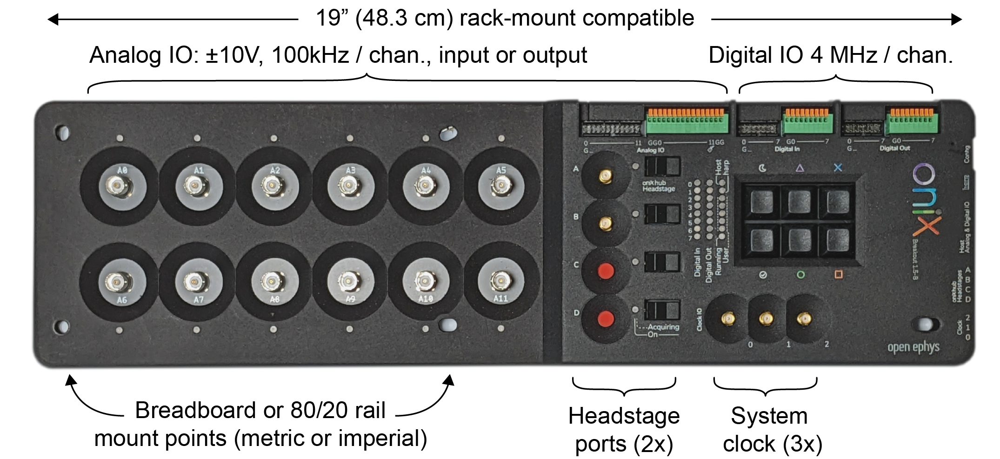

These are the devices available on the Breakout Board:

1. [Digital Input](xref:breakout_digital-inputs): 8 bits GPI and button state, 5V tolerant, 4 MHz/channel.
1. [Digital Output](xref:breakout_digital-outputs): 8 bits of GPO updated at 4 MHz/channel.
1. [Analog IO](xref:breakout_analog-io)
    - 12 channels, 100 kHz per channel, independently configurable as input or output.
    - [Input](xref:breakout_analog-io#analog-inputs): independently configurable as ±2.5V, ±5V, or ±10V input voltage range.
    - [Output](xref:breakout_analog-io#analog-outputs): fixed ±10V output voltage range.
1. [Heartbeat](xref:breakout_heartbeat)
    - Periodic signal from host with adjustable beat frequency.
1. [Memory Monitor](xref:breakout_memory-monitor)
    - Diagnostic device for monitoring hardware first-in, first-out memory use.
    - Used for tune real-time feedback loops for minimal latency.
    - Note: _disabled by default_.

The following pages in the Breakout Board Guide provide an example workflow, a breakdown of its components, and a Python script for loading data.

> [!TIP]
> Visit the [Breakout Board Hardware Guide](https://open-ephys.github.io/onix-docs/Hardware%20Guide/Breakout%20Board/index.html) to learn more about the hardware such as the LED indicators and various connectors.