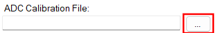

# NeuropixelsV1e GUI

The `NeuropixelsV1e` headstage has a graphical user interface when the `OpenEphys.Onix1.Design` package is downloaded. For more information on how to install that library, check out the <xref:install-configure-bonsai> page.

## Overview

For `NeuropixelsV1eHeadstage`, the GUI allows for an easy way to change settings and visualize the effect. From the GUI, you can:

- Configure the <xref:OpenEphys.Onix1.NeuropixelsV1eProbeConfiguration>
    - Choose the ADC calibration file
    - Choose the gain calibration file
    - Choose the AP and LFP gain values
    - Enable or disable the AP-band spike filter
    - Change the [reference](xref:OpenEphys.Onix1.NeuropixelsV1ReferenceSource) for all electrodes
    - Choose pre-defined channel presets or manually define within a constrained set of possible combinations
    - Easily visualize which electrodes are enabled
- Configure the [Bno055](xref:OpenEphys.Onix1.ConfigurePolledBno055)
    - Enable and disable the <xref:OpenEphys.Onix1.PolledBno055Data> stream

The configuration dialog is accessible by double-clicking on the <xref:OpenEphys.Onix1.ConfigureNeuropixelsV1eHeadstage> operator.

### Channel constraints

For `NeuropixelsV1e`, there will always be 384 channels enabled across the entire probe. Therefore, when enabling electrodes (either [manually](#manually-enabling-electrodes) or using [channel presets](#channel-presets)), some previously enabled electrodes will be disabled. Additionally, if more than 384 electrodes are manually selected to be enabled, only the last 384 channels will end up being enabled. It is therefore recommended to always double-check that the correct electrodes are enabled. 

As an example, let us assume that electrodes `0` through `383` are initially enabled (this corresponds to 384 channels). Then, electrodes `384` and `385` are enabled. When these electrodes are enabled, electrodes `0` and `1` will be disabled. In this way, there will always be 384 channels enabled.

In addition to the absolute number of channels, there are other restrictions in place regarding which combinations of electrodes can be enabled at any given time. Specifically, in the <xref:OpenEphys.Onix1.NeuropixelsV1eElectrode> there is a `Channel` property which defines the channel index of an electrode. Across the entire probe, no two electrodes that share the same `Channel` can be simultaneously enabled. 

[Channel presets](#channel-presets) take this into account automatically and ensure that the rules are followed. When manually enabling electrodes, the indexing logic is applied in the order that electrodes are selected. If two (or more) electrodes are selected that share a `Channel` value, the highest indexed electrode is the only one that will be enabled.

> [!NOTE]
> Due to these constraints, it is possible that a desired combination of electrodes is not feasible.

### Keeping or discarding configuration settings

While the GUI is open, any changes to the configuration settings can be freely modified and will not affect the configuration unless `Okay` is pressed. This includes all aspects of the configuration, such as which electrodes are enabled, the chosen reference channel, and the probe calibration file.

> [!NOTE]
> The hardware is not actually configured until the workflow starts.

If the window is closed any other way (such as by pressing `Cancel`, or pressing the <kbd>X</kbd> to close the window), then any changes made *will not* be saved.

### ProbeInterface

The `NeuropixelsV1eHeadstage` GUI uses [ProbeInterface](https://probeinterface.readthedocs.io/en/main/index.html) as the format to draw the probes and electrodes visually. For more information on ProbeInterface and the resulting JSON file, check out their [format specifications](https://probeinterface.readthedocs.io/en/main/format_spec.html) page. 

When opening the GUI, there is a default probe configuration that is loaded and drawn, which can be saved to a [JSON file](#save-probeinterface-file). Conversely, an existing JSON file can be [loaded](#load-probeinterface-file) to update the current channel configuration. If for any reason the default configuration is needed, it can be [loaded again](#load-default-configuration) at any time.

## Open Headstage Configuration GUI

To open the headstage configuration GUI, double-click the `ConfigureNeuropixelsV1eHeadstage` operator.

Once opened, if the calibration files have not been selected the window should look like the image below. To view the probe, follow the steps below to [choose calibration files](#choosing-probe-calibration-files).

### Choosing probe calibration files

Upon opening the GUI for the first time, if no probe calibration files were set in the Bonsai editor, the window will be mostly blank. To populate the window with a drawing of the probe, both calibration files must be selected. First, click on the <kbd>...</kbd> button to the right of the empty text box under "ADC Calibration File" (see below). This will open a file dialog, where the ADC calibration file can be searched for and selected. Once the file is selected, press `Open` or <kbd>Enter</kbd>. This will populate the text box with the filepath to the calibration file.

  

This process is then repeated for the gain calibration file; click on the <kbd>...</kbd> button to the right of the empty text box under `Gain Calibration File` (see below). This will open a file dialog, where the gain calibration file can be searched for and selected. 

  

> [!NOTE]
> Files are expected to be named `XXXXXXXXXXX_ADCCalibration.csv` and `XXXXXXXXXXX_gainCalValues.csv`, where "XXXXXXXXXXX" is the probe serial number.

Once both files are selected, this will enable visualization of the electrodes. Below is a view of the configuration GUI that has been opened after both calibration files have been selected.

### Status strip

Towards the bottom of the GUI, there is a status strip that reports the serial number found in the selected calibration files. Next to the reported serial numbers is a status symbol indicating if there any potential issues. Below is a list of possible states the status strip will display:

| Symbol | Reason |
| :---: | :---: |
|  | One or no files are selected |
|  | One or more files are invalid |
|  | Different serial numbers reported |
|  | Files are valid, and serial numbers match |

### View ADC correction values

Once a valid ADC calibration file has been selected, the <kbd>View ADC Correction Values</kbd> button will be enabled. This button can be pressed to open a new dialog that displays the correction values for all ADCs. Refer to <xref:OpenEphys.Onix1.NeuropixelsV1eAdc> for more details on the specific calibration values.

### Selecting AP gain

The gain for the AP-band can be selected from the dropdown menu next to `AP Gain`. For a list of possible gain values, check out <xref:OpenEphys.Onix1.NeuropixelsV1Gain>. If a gain calibration file has been selected and is valid, the gain correction that will be applied is displayed in the textbox underneath the dropdown menu and is updated based on the current gain selected.

  

### Selecting LFP gain

The gain for the LFP-band can be selected from the dropdown menu next to `LFP Gain`. For a list of possible gain values, check out <xref:OpenEphys.Onix1.NeuropixelsV1Gain>. If a gain calibration file has been selected and is valid, the gain correction that will be applied is displayed in the textbox underneath the dropdown menu and is updated based on the current gain selected.

  

### Enabling spike filter

A checkbox allows enabling or disabling of the spike-band filter. If enabled, the spike-band has a 300 Hz high-pass filter which will be activated. If set to false, the high-pass filter will not to be activated.

  

### Selecting channel reference

Underneath the probe calibration filepath, there is a dropdown menu for choosing the reference for all channels. For possible values and a brief description of what they correspond to, check out the [references page](xref:OpenEphys.Onix1.NeuropixelsV1ReferenceSource).

  

### Channel presets

To save time, it is possible to select a preset channel combination from the `Channel Presets` dropdown. These presets are defined to work within the constraints of `NeuropixelsV1e` channel combinations defined [above](#channel-constraints).

  

Below is a list of available channel presets:
- Bank [A | B | C]
    - Enables all electrodes in the chosen bank
    - To learn more about banks, check out <xref:OpenEphys.Onix1.NeuropixelsV1Bank>.
- Single Column
    - Enables all even electrodes on Bank A, then all odd electrodes on Bank B
- Tetrodes
    - Enables the first group of four electrodes for every eight electrodes (electrodes 0-3 but not 4-7) in Bank A, then enables the second group of four for every eight electrodes in Bank B (388-391, but not 384-387).

If electrodes are manually enabled, the `Channel Presets` dropdown will change to **None**, indicating that a channel preset is no longer selected.

### Maneuvering along the probe

Once a GUI has been [opened](#open-headstage-configuration-gui) and a probe calibration file has been [selected](#choosing-probe-calibration-files), the main panel on the left will be populated with a `NeuropixelsV1e` probe. Below are the buttons used to navigate within this panel to view and choose electrodes.

- Mouse Controls
    - Mouse wheel zooms in/out towards the cursor
    - Left-click and drag will select electrodes within the drawn rectangle
    - Left-click on an electrode will select that electrode
    - Left-click in empty space will clear the selected electrodes
    - Middle-click and drag will pan the electrodes
- Scroll bar
    - On the right side of the main panel there is a scroll bar that can be used to move the probe up and down
    - Panning the probe up or down will update the scroll bar once the movement has completed
    - The scroll bar can be moved by:
        - Grabbing the marker using the mouse and dragging it up or down
        - Placing the cursor either above or below the marker and clicking
        - Using the mouse wheel to scroll up or down while the cursor is over the scroll bar

### Zoom and pan limits

When zooming in and out, note that there are limits in both directions. The probe can only be zoomed out to the point that the entire probe is visible within the panel and no more. Similarly, while zooming in the probe will not zoom in past a certain point. 

In addition to the absolute zoom limits, the panel will automatically shift the probe to ensure it is always in view. This is handled each time the probe is zoomed or panned.

To reset the view at any time, click on the `Reset Zoom` button to fully zoom out the panel.

### Manually enabling electrodes

Electrodes can be selected at any zoom level, but it is often preferable to zoom in to read the electrode indices. Consider maximizing the window to see those numbers more easily.

To select, as described [above](#maneuvering-along-the-probe), either click-and-drag the cursor over the desired electrodes, or select individual electrodes by clicking on them one-by-one. Once the electrodes to enable are selected, click on the `Enable Selected Electrodes` button in the right panel. At this point the selected electrodes should turn blue, indicating that they are now enabled. It is important to note that when electrodes are enabled, a number of previously enabled electrodes will be disabled due to channel constraints. For more information, read the [Channel constraints](#channel-constraints) section above.

The short video below shows how to select, clear selection, enable selected electrodes, and translate using the scroll bar. Note that once electrodes are manually enabled, the `Channel Presets` drop-down changes from `BankA` to `None`. Then, once the selected electrodes match the preset, it is automatically changed back to `BankA`.

  <video width="650" height="365" controls muted loop>
    <source src="../../../images/neuropixelsv1e-gui-tut/headstage-configuration-enable-electrodes.webm">
  </video>

### Loading and saving channel configurations

When the GUI is first opened and after a probe calibration file has been specified, the default [ProbeInterface](#probeinterface) configuration is loaded and drawn in the main panel. In this case, the default configuration is for a single-shank `NeuropixelsV1e` probe, with the `BankA` channel preset selected. To load a new configuration, load the default configuration, or save the current configuration, go to the File drop-down menu (see below) and choose the relevant option.

  

#### Save ProbeInterface file

To save a [ProbeInterface](#probeinterface) JSON file fully describing the probe, including which electrodes are currently enabled, go to the File drop-down menu, and select `NeuropixelsV1e → Save Channel Configuration`. This will open a file dialog window to save the new JSON file. Choose a folder location and a name for the file, then hit `Save`. This will export the current channel configuration. This is a useful way to save any manually enabled electrodes as a backup, or to easily switch between different configurations between recordings.

#### Load ProbeInterface file

To load a [ProbeInterface](#probeinterface) JSON file, navigate to the File drop-down menu and select `NeuropixelsV1e → Load Channel Configuration`. This will open a file dialog window; browse to the existing JSON file, select it and press `Open` to load the channel configuration. The new probe shape will be loaded and drawn, with the enabled electrodes highlighted as usual.

> [!NOTE]
> When loading a new configuration, the total number of electrodes must match the existing configuration, and the number of enabled electrodes must match.

#### Load default configuration

To load the default channel configuration at any time, navigate to the File drop-down menu and choose `NeuropixelsV1e → Load Default Channel Configuration`. This will load the default configuration, with the `BankA` channel preset selected.

### Configure Bno055

At the headstage level, there is another device tab listed for a [Bno055](xref:OpenEphys.Onix1.PolledBno055Data). From this tab, the device can be enabled or disabled by selecting the appropriate value from the drop-down menu next to `Enable`. While other properties are displayed here, they have no affect on the underlying device configuration; only changes to the `Enable` property will be respected.

