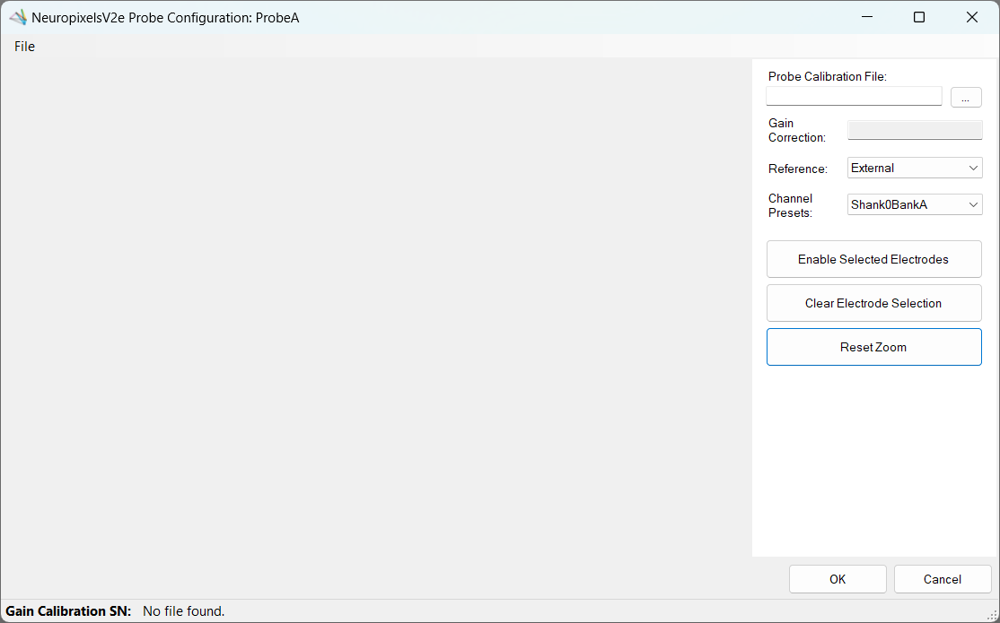
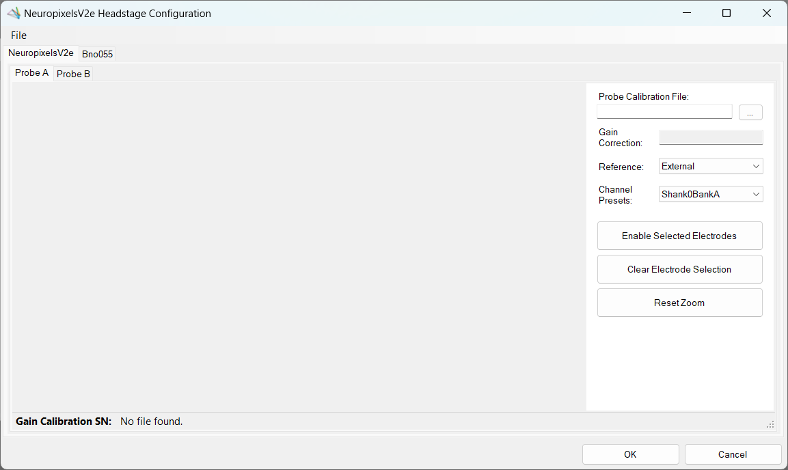

# NeuropixelsV2e GUI

In addition to the capabilities described in <xref:np2e>, the `NeuropixelsV2e` headstage has a graphical user interface when the `OpenEphys.Onix1.Design` package is downloaded. For more information on how to install that library, check out the <xref:install-configure-bonsai> page.

## Overview

For `NeuropixelsV2eHeadstage`, the GUI allows for an easy way to change settings and visualize the effect. From the GUI, you can:

- Configure `Probe A` and `Probe B` independently
    - Choose the probe calibration file
    - Change the [reference](xref:OpenEphys.Onix1.NeuropixelsV2QuadShankReference) for all electrodes
    - Choose pre-defined channel presets or manually define within a constrained set of possible combinations
    - Easily visualize which electrodes are enabled
- Enable and disable the <xref:OpenEphys.Onix1.NeuropixelsV1eBno055Data> stream

There are two ways to access configuration dialogs; 1) at the individual `NeuropixelsV2eProbeConfiguration` level where either `Probe A` or `Probe B` can be modified by itself, and 2) at the headstage level where both probes can be modified, as well as the `NeuropixelsV2eBno055` device.

Whether the GUI is opened at the probe configuration level, or the headstage level, the usage will be almost identical. There are some additional tabs present at the headstage level, but the `Probe A` and `Probe B` tabs will act exactly the same as opening a probe configuration GUI for that specific probe.

### Channel constraints

For `NeuropixelsV2e`, there will always be 384 channels enabled across the entire probe. Therefore, when enabling electrodes (either [manually](#manually-enabling-electrodes) or using [channel presets](#channel-presets)), some previously enabled electrodes will be disabled. Additionally, if more than 384 electrodes are manually selected to be enabled, only the last 384 channels will end up being enabled. It is therefore recommended to always double-check that the correct electrodes are enabled. 

As an example, let us assume that electrodes `0` through `383` are initially enabled (this corresponds to 384 channels). Then, electrodes `384` and `385` are enabled. When these electrodes are enabled, electrodes `0` and `1` will be disabled. In this way, there will always be 384 channels enabled.

In addition to the absolute number of channels, there are other restrictions in place regarding which combinations of electrodes can be enabled at any given time. Specifically, in the <xref:OpenEphys.Onix1.NeuropixelsV2QuadShankElectrode> there is a `Channel` property which defines the channel index of an electrode. Across the entire probe, no two electrodes that share the same `Channel` can be simultaneously enabled. 

[Channel presets](#channel-presets) take this into account automatically and ensure that the rules are followed. When manually enabling electrodes, the indexing logic is applied in the order that electrodes are selected. If two (or more) electrodes are selected that share a `Channel` value, the highest indexed electrode is the only one that will be enabled.

> [!CAUTION]
> Due to these constraints, it is possible that a desired combination of electrodes is not feasible.

### Keeping or discarding configuration settings

While the GUI is open, any changes made to the configuration settings can be freely modified and will not affect the configuration unless `Okay` is pressed. This includes all aspects of the configuration, such as which electrodes are enabled, the chosen reference channel, and even the probe calibration file.

If the window is closed any other way (such as by pressing `Cancel`, or pressing the <kbd>X</kbd> to close the window), then any changes made *will not* be saved.

### ProbeInterface

The `NeuropixelsV2eHeadstage` GUI uses [ProbeInterface](https://probeinterface.readthedocs.io/en/main/index.html) as the format to draw the probes and electrodes visually. For more information on ProbeInterface and the resulting JSON file, check out their [format specifications](https://probeinterface.readthedocs.io/en/main/format_spec.html) page. 

When opening the GUI, there is a default probe configuration that is loaded and drawn, which can be saved to a [JSON file](#save-probeinterface-file). Conversely, an existing JSON file can be [loaded](#load-probeinterface-file) to update the current channel configuration. If for any reason the default configuration is needed, it can be [loaded again](#load-default-configuration) at any time.

## Open Probe Configuration GUI

{width=700px}

Steps to open the Probe Configuration GUI:
- Select the `NeuropixelsV2eHeadstage` node.
- Click on the `NeuropixelsV2eProbeConfiguration` to edit (either `ProbeConfigurationA` or `ProbeConfigurationB`).
- Select the button showing three dots (ellipsis) on the right-most part of the property pane (#1 above).

Once opened, if no probe calibration file has been selected the window should look like the image below. To view the probe, follow the steps [below](#choosing-a-probe-calibration-file).

{width=700px}

> [!TIP]
> The controls shown for this GUI are the same as the ones shown for the `NeuropixelsV2e Headstage Configuration` below.

### Choosing a probe calibration file

Upon opening the GUI for the first time, if no probe calibration file was set in the Bonsai editor, the window will be mostly blank. To populate the window with a drawing of the probe, click on the ellipsis button to the right of the empty text box under "Probe Calibration File:" (see below). This will open a file dialog, where the calibration file can be searched for and selected. 

  

> [!NOTE]
> Files are expected to be named `XXXXXXXXXXX_gainCalValues.csv`, where "XXXXXXXXXXX" is the probe serial number.

Once the file is selected, press `Open` or <kbd>Enter</kbd>. This will populate the text box with the filepath to the calibration file, and enable visualization of the electrodes. Below is a view of the Probe Configuration GUI that has been opened for `Probe A` with a gain calibration file selected.

{width=700px,align="center"}

### Selecting channel reference

  

Underneath the probe calibration filepath, there is a dropdown menu for choosing the reference for all channels. For possible values and a brief description of what they correspond to, check out the [references page](xref:OpenEphys.Onix1.NeuropixelsV2QuadShankReference).

### Channel presets

To save time, it is possible to select a preset channel combination from the `Channel Presets:` dropdown. These presets are defined to work within the constraints of `NeuropixelsV2e` channel combinations defined [above](#channel-constraints).

  

Channel presets follow one of these patterns:
- Shank N Bank [A | B | C | D]
    - Enables all electrodes in the chosen bank on shank N
    - To learn more about the banks along each shank, check out the <xref:OpenEphys.Onix1.NeuropixelsV2QuadShankBank> page.
- All Shanks N_M
    - Enables all electrodes starting at shank index N up to shank index M across all four shanks

If electrodes are manually enabled, the `Channel Presets:` dropdown will change to **None**, indicating that a channel preset is no longer selected.

### Maneuvering along the probe

Once a GUI has been [opened](#open-probe-configuration-gui), and a probe calibration file has been [selected](#choosing-a-probe-calibration-file), the main panel on the left will be populated with a `NeuropixelsV2e` probe. Below are the buttons used to navigate within this panel to view and choose electrodes.

- Mouse Controls
    - Mouse wheel zooms in/out towards the cursor
    - Left-click and drag will select electrodes within the drawn rectangle
    - Left-click on an electrode will select that electrode
    - Left-click in empty space will clear the selected electrodes
    - Middle-click and drag will pan the electrodes
- Scroll bar
    - On the right side of the main panel there is a scroll bar that can be used to move the probe up and down
    - Panning the probe up or down will update the scroll bar once the movement has completed
    - The scroll bar can be moved by:
        - Grabbing the marker using the mouse and dragging it up or down
        - Placing the cursor either above or below the marker and clicking
        - Using the mouse wheel to scroll up or down while the cursor is over the scroll bar

### Zoom and pan limits

When zooming in and out, note that there are limits in both directions. The probe can only be zoomed out to the point that the entire probe is visible within the panel and no more. Similarly, while zooming in the probe will not zoom in past a certain point. 

In addition to the absolute zoom limits, the panel will automatically shift the probe to ensure it is always in view. This is handled each time the probe is zoomed or panned.

To reset the view at any time, click on the `Reset Zoom` button to fully zoom out the panel.

### Manually enabling electrodes

Electrodes can be selected at any zoom level, but it is often preferable to zoom in to read the electrode indices. Consider maximizing the screen to see those numbers more easily.

To select, as described [above](#maneuvering-along-the-probe), either click-and-drag the cursor over the desired electrodes, or select individual electrodes by clicking on them one-by-one. Once the electrodes to enable are selected, click on the `Enable Selected Electrodes` button in the right panel. At this point the selected electrodes should turn blue, indicating that they are now enabled. It is important to note that when electrodes are enabled, a number of previously enabled electrodes will be disabled due to channel constraints. For more information, read the [Channel constraints](#channel-constraints) section above.

The short video below shows how to select, clear selection, enable selected electrodes, and translate using the scroll bar. Note that once electrodes are manually enabled, the `Channel Presets:` drop-down changes from `Shank0BankA` to `None`. Then, once the selected electrodes match the preset, it is automatically changed back to `Shank0BankA`.

  <video width="650" height="365" controls autoplay muted loop>
    <source src="~/images/neuropixelsv2e-gui-tut/probeconfiguration-enable-electrodes.webm">
  </video>

### Loading and saving channel configurations

When the GUI is first opened, and after a probe calibration file has been specified, the default [ProbeInterface](#probeinterface) configuration is loaded and drawn in the main panel. In this case, the default configuration is for a quad-shank `NeuropixelsV2e` probe, with the `Shank0BankA` channel preset selected. To load a new configuration, load the default configuration, or save the current configuration, go to the File drop-down menu (see below) and choose the relevant option.

  

#### Save ProbeInterface file

To save a [ProbeInterface](#probeinterface) JSON file fully describing the probe, including which electrodes are currently enabled, go to the File drop-down menu, and select `Save Channel Configuration`. This will open a file dialog window to save the new JSON file. Choose a folder location and a name for the file, then hit `Save`. This will export the current channel configuration. This is a useful way to save any manually enabled electrodes as a backup, or to easily switch between different configurations between recordings.

#### Load ProbeInterface file

To load a [ProbeInterface](#probeinterface) JSON file, navigate to the File drop-down menu and select `Load Channel Configuration`. This will open a file dialog window; browse to the existing JSON file, select it and press `Open` to load the channel configuration. The new probe shape will be loaded and drawn, with the enabled electrodes highlighted as usual.

> [!NOTE]
> When loading a new configuration, the total number of electrodes must match the existing configuration, and the number of enabled electrodes must match.

#### Load default configuration

To load the default channel configuration at any time, navigate to the File drop-down menu and choose `Load Default Channel Configuration`. This will load the default configuration, with the `Shank0BankA` channel preset selected.

## Open Headstage Configuration GUI

{width=700px}

Step to open the headstage configuration GUI

  - Double-click the `NeuropixelsV2eHeadstage` node (#2 above)

Once opened, if no probe calibration is selected for either `Probe A` or `Probe B`, then both tabs will only show their controls on the right and no probes (see below).

{width=700px}

### Configure Probe A

Using the headstage configuration GUI is exactly the same as using the [probe configuration GUI](#open-probe-configuration-gui). After the GUI has been [opened](#open-headstage-configuration-gui), and a probe calibration file has been [selected](#choosing-a-probe-calibration-file), `Probe A` will be drawn in the corresponding tab (see below).

{width=700px}

### Configure Probe B

Using the headstage configuration GUI is exactly the same as using the [probe configuration GUI](#open-probe-configuration-gui). After the GUI has been [opened](#open-headstage-configuration-gui), and a probe calibration file has been [selected](#choosing-a-probe-calibration-file), `Probe B` will be drawn in the corresponding tab (see below).

{width=700px}

### Configure Bno055

At the headstage level, there is another device tab listed for a [Bno055](xref:OpenEphys.Onix1.NeuropixelsV2eBno055Data). From this tab, the device can be enabled or disabled by selecting the appropriate value from the drop-down menu next to `Enable`. While the `DeviceAddress` and `DeviceName` values are modifiable here, they have no affect on the underlying device configuration; only changes to the `Enable` property will be respected.

{width=700px}
