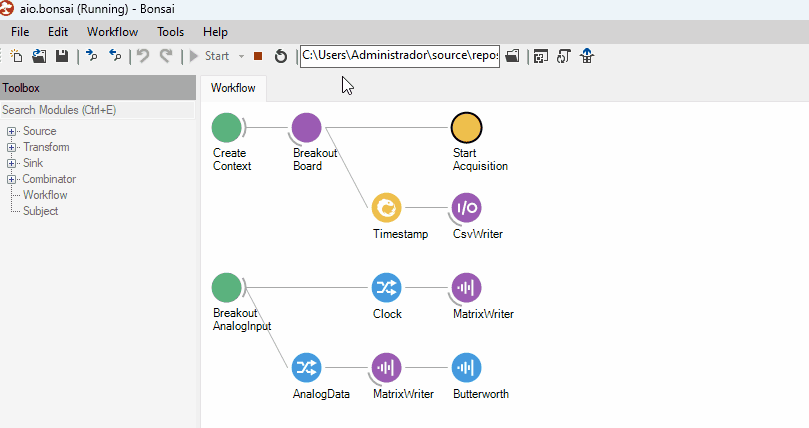

> [!TIP]
> When trying to understand a workflow's operation, its very useful to visualize the data generated
> by each operator. You can open an operator's visualizer by double clicking the node while the
> workflow is running. The type of visualizer that opens will depend on the type of data handled by
> the operator and whether or not the appropriate Design library has been installed.
>
> 