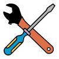

`OpenEphys.Onix1` is a library that can be used in [Bonsai](https://bonsai-rx.org/) to acquire data from ONIX devices, such as the [ONIX PCIe Acquisition System](https://open-ephys.org/onix/oeps-9006). For more details on the ONI specification, check out [this link](https://open-ephys.github.io/ONI/), and to learn more about ONIX devices and their implementation of ONI, click [here](https://open-ephys.github.io/onix-docs/).

## Advantages

While data can be acquired using programs other than Bonsai, there are a number of advantages that come from building `OpenEphys.Onix1` as a Bonsai library. A major advantage is that it maintains maximal compatibility with open source programs, including [OpenCV](https://opencv.org/), [DeepLabCut](https://www.mackenziemathislab.org/deeplabcut), and many more.

Other major advantages include:
* Visual interface provided by building on top of Bonsai's foundation
* Time-stamped synchronization across multiple devices
* Combine data streams for real-time processing

 

### Quick Links
 

| <xref:getting-started> | [Operator Reference](xref:OpenEphys.Onix1) | <xref:tutorials> | [Hardware Guide](https://open-ephys.github.io/onix-docs/) |
|:----:|:----:|:----:|:----:|
| [{width=150}](xref:getting-started) | [{width=150}](xref:OpenEphys.Onix1) | [{width=150}](xref:tutorials) |[{width=150}](https://open-ephys.github.io/onix-docs/)|

 

### Why Bonsai?

ONIX is built on the [ONI standard](https://open-ephys.github.io/ONI/), which is software
agnostic. Bonsai is the first software target pursued by the Open Ephys team for
ONIX hardware. There are three major reasons for this:

1. **Performance.** ONIX is a universal interface for neural recording instruments. It can
   capture data produced by neural probes, cameras, high-speed ADCs, etc. In
   general terms, ONIX can capture data from arbitrary mixtures of
   asynchronous[^1] data sources. Bonsai provides an extremely powerful,
   open-source software platform for elegantly collecting, combining, and
   processing data from essentially any data source regardless of its sample
   rate, sample regularity, packet size, and bandwidth. Bonsai accomplishes this
   task in a fundamental manner: it explicitly models each data source as an
   ordered temporal sequence with a start and end called an
   [Observable](https://reactivex.io/documentation/observable.html). This is
   analogous to how, for instance,
   [Numpy](https://numpy.org/doc/stable/index.html) explicitly models fixed-size
   multi-dimensional arrays as
   [ndarrays](https://numpy.org/doc/stable/reference/generated/numpy.ndarray.html#numpy.ndarray).
   And, just like Numpy offers an extensive linear algebra toolkit
   to operate on these arrays, Bonsai offers an analogous
   [toolkit](https://reactivex.io/documentation/operators.html)
   for operating on temporal sequences of data. Because Bonsai was created around this core
   data model and operator library, it makes capturing, processing, and combining data
   sequences from different hardware sources natural in Bonsai, whereas it is
   bug prone and difficult in other software options.
1. **Code quality.** Open Ephys has been developing open source hardware and
   software for the Neuroscience community for over a decade. In terms of code
   quality, Bonsai is excellent. Bonsai uses a modern language and build system,
   has integrated package management, and an extremely clean, featureful, and well
   maintained API. Given that Bonsai's development model perfectly aligns with our
   values, we are very proud to be able to contribute to its growth in the
   Neuroscience community.
1. **Third party integration.** Bonsai provides support for
   hundreds of pieces of open- and closed-source hardware and software that are
   used extensively in neuroscience research. For instance:

    - The classic Open Ephys [acquisition system](https://open-ephys.org/acquisition-system)
    - [Ucla Miniscope ecosystem](https://open-ephys.github.io/miniscope-docs/index.html)
    - [National Instruments](https://bonsai-rx.org/daqmx/articles/intro.html) acquisition boards
    - Virtually every machine-vision and sCMOS camera[^2]
    - [Sanworks Bpod](https://sanworks.github.io/Bpod_Wiki/)
    - [Harp](https://harp-tech.org/index.html)
    - [Deeplabcut](https://github.com/bonsai-rx/deeplabcut) & [Sleap](https://github.com/bonsai-rx/sleap)
    - And much more

   By targeting Bonsai, ONIX can be used seamlessly with these third party tools.

> [!NOTE]
> We put a lot of effort into
> making these docs useful for everyone. If you have suggestions for making
> them even better, please contribute by either [raising an
> issue](https://github.com/bonsai-rx/docs/issues) or following the links saying
> **Edit this page**. We welcome all constructive feedback. As always, our goals
> are better performing tools, less redundant development, and more reproducible
> science.
>
> In addition to this library, we are currently developing ONIX support for the
[Open Ephys GUI](https://open-ephys.org/gui/). 

[^1]: Although physical data sources are asynchronous (e.g. a Neuropixels probe
runs on a distinct clock and produces data at a distinct rate compared to the
camera sensor on a Miniscope), all data is hardware-timestamped on a common
clock. No post-hoc data alignment is required.

[^2]: [Flir](https://github.com/bonsai-rx/spinnaker), [Allied
Vision](https://github.com/bonsai-rx/vimba),
[Ximea](https://github.com/bonsai-rx/ximea),
[Basler](https://github.com/bonsai-rx/pylon),
[Excelitas](https://github.com/bonsai-rx/pco), etc.