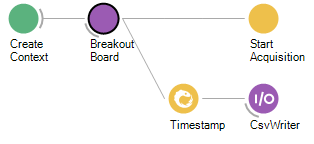
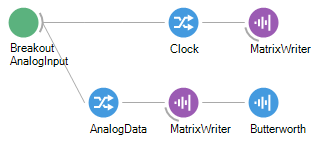
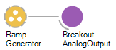
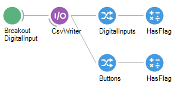
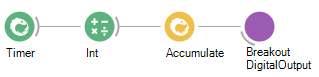
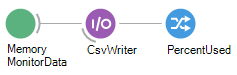
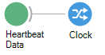

# Breakout Board Tutorial

:::workflow 

:::

In this example, we will explore the breakout board's functionality by demoing its capabilities. The workflow above can by copied and pasted int your bonsai editor using the clipboard icon in the top right. This workflow capures data from the analog and digital inputs on the breakout board and streams and streams them to disk. The analog and digital outputs are both driven by an internally generated ramp signals. The hardware memory use is monitored and saved.

> [!TIP]
> If you want a less busy starting point for using the breakout board then have a look at the <xref:headstage-breakoutboard> in the user guide.

## Configuring the breakout board
We start by configuring the hardware using a configuration chain. This chain creates a hardware context using <xref:OpenEphys.Onix1.CreateContext>, adds a breakout board configuration using <xref:OpenEphys.Onix1.ConfigureBreakoutBoard>, and then starts acquisition using <xref:OpenEphys.Onix1.StartAcquisition>. 

- The <xref:OpenEphys.Onix1.CreateContext> operator determines the device driver and host-computer index that the system communicates through. The `Driver` property is to ["riffa"](https://github.com/open-ephys/liboni/tree/main/drivers/riffa), which is the name of the the PCIe device used by ONIX. In our case, we have a single ONIX system, the the `Index` property is set to 0.
- The <xref:OpenEphys.Onix1.ConfigureBreakoutBoard> operator is used to configure the breakout board. The configuration settings for the breakout board can be examined and edited by clicking on the operator to highlight it, which opens its property pane to the right of the editor. Expanding of the members of the property pane allows you to configure the operation of each device within the breakout board. In this demo, the breakout board properties are set to their default values with two exceptions: 
    - Analog channel 0 is set to be an Output by setting its `Direction0` property to `Output`. 
    - The MemoryMonitor is enabled by setting its `Enable` property to `True`.
  {width=650px}
- The <xref:OpenEphys.Onix1.StartAcquisition> operator begins acquisition after the hardware has been configured. In this example, we are going to be capturing data from the breakout board only, so the rate of data being produced by the hardware will be relatively modest (~2.5 MB/s), and dominated by the analog inputs. We are using a `BlockReadSize` of 2048 bytes. This means that the data reading thread will block until 2048 bytes of data have been produced by the hardware. At 2.5 MB/s
the hardware will produce 2048 every 800 microseconds or so. This is a hard bound on the latency of the system. If lower latencies were required, the hardware would need to produce data more quickly or the `BlockReadSize` would need to be reduced. The and `BlockWriteSize` is also set to 2048 bytes. This determines the amount of memory that is preallocated for temporarily holding data before it is sent to hardware. It is less critical to performance unless the rat that data be written to the hardware is comparable to the rate that the hardware produces data, which is not a common scenario.
- Aside from the configuration operations, the output of the <xref:OpenEphys.Onix1.ConfigureBreakoutBoard> operator is timestamped and then saved to a CSV file. This file will contain the wall-clock time that data collection start along with metadata concerning important system configuration settings, such as the `BlockReadSize` and `BlockWriteSize`.

## Streaming breakout board data
Following the configuration chain, the the remaining processing graphs of the workflow are used to capture from or send data to the breakout board. We will step through each of these.

### Analog inputs

The first processing graph captures data from the breakout board's analog inputs using <xref:OpenEphys.Onix1.BreakoutAnalogInput> which is configured as follows:
- The `DeviceName` is set to `BreakoutBoard/AnalogIO`. In our system, this is the only selection available in the drop down menue since only a single breakout board was configured in the configuration chain.
- The `BufferSize` is set to 50. This means that 50 samples will be collected from each of the the 12 analog inputs and packed into a <xref:OpenEphys.Onix1.BreakoutAnalogInputDataFrame> that is propagated downstream (each frames will contain a 50-element `Clock` vector and a 12x50 `AnalogData` matrix). The analog inputs are sampled at 100 kHz per channel so this corresponds to 500 microseconds of data. That's lower than the minimal latency introduced by the `BlockReadSize` setting. Therefore, our choosen `BufferSize` will not impose a significant effect on processing latency: the buffer will be filled essentially every time hardware is accessed and propagated nearly instantly.
- The `DataType` is set to `Volts`. This means that samples will be represented as single-precision floating point voltages.
The <xref:OpenEphys.Onix1.BreakoutAnalogInputDataFrame> sequence is split into `Clock` and  `AnalogData` sequences, which contain the acquisition clock sample times and sample values, respectively (right-click the operator and select `Output` to examine and expand output types). Both of these streams are saved to disk using a `MatrixWriter`. The  `AnalogData` is passed through is passed through a 1 kHz low-pass Butterworth filter for demonstration purposes. Note that although analog channel 0 is set to an output, it is still recorded. This provides a automatic and hardware-synchronized measurement of the output voltage being sent to channel 0.

### Analog outputs

A ~100 Hz timer is used to update analog output 0. If the value in the `ScalarBuffer` node is changed while the workflow is running, channel 0's voltage will be updated.

### Digital inputs

Digital input data is passed through `HasFlag` filters that can be used to determine if a certain digital input pin is logic-high or to check if a certain button has been depressed.

### Digital outputs

A ~10 Hz timer drives the digital output port with counter. The LEDs on the breakout board will show a binary count for 0 to 255 before the pattern repeats

### Memory monitor

### Heartbeat

## Loading data

