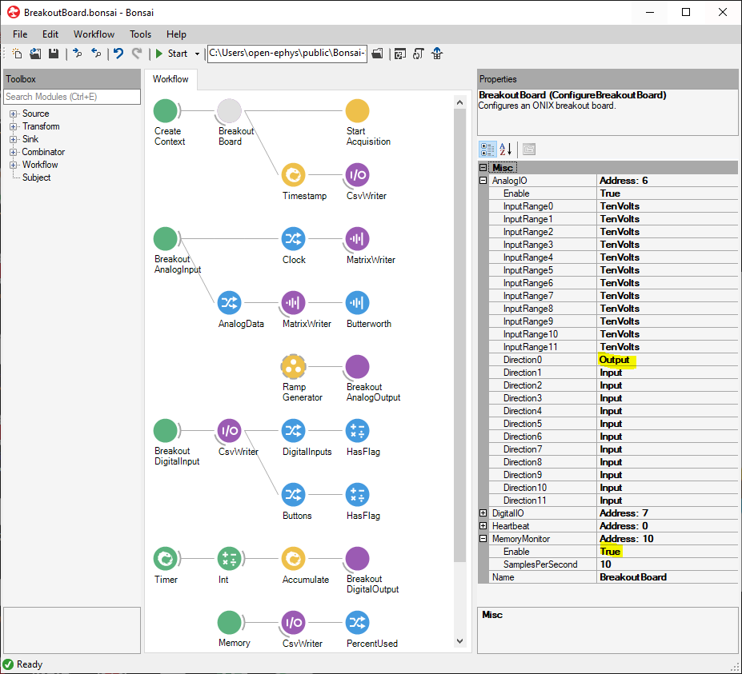

# Breakout Board Tutorial
In this example, we will explore the breakout board's functionality by demoing its capabilities. The workflow below can by copy/pasted into the Bonsai editor using the clipboard icon in the top right. This workflow:

- Captures data from the analog and digital inputs on the breakout board and streams them to disk
- Generates signals to drive the breakout boards analog and digital outputs
- Monitors and saves hardware memory buffer use information.
- Monitors the breakout board's heartbeat signal

In the following sections, we break this workflow into components and provide an explanation for each.

:::workflow 

:::

> [!TIP]
> If you want a less busy starting point for using the breakout board then have a look at the <xref:headstage-breakoutboard> in the user guide.

## Configuring the breakout board
We start by configuring the hardware using a configuration chain. This chain creates a ONIX acquisition context using <xref:OpenEphys.Onix1.CreateContext>, configures a breakout board using <xref:OpenEphys.Onix1.ConfigureBreakoutBoard>, and then starts acquisition using <xref:OpenEphys.Onix1.StartAcquisition>. Here we break down each of these operators.

### CreateContext
The <xref:OpenEphys.Onix1.CreateContext> operator determines creates a "context" that determines the device driver, physical interface type, and host-computer index that the system communicates through. The `Driver` property is set to "riffa", which is the name of the PCIe device used by ONIX. In our case, because we are using a single ONIX system, the `Index` property is set to 0. If second system was used on the same computer, a second <xref:OpenEphys.Onix1.CreateContext> operator would be required and its `Index` property set to 1.

### ConfigureBreakoutBoard
The <xref:OpenEphys.Onix1.ConfigureBreakoutBoard> operator is used to configure the breakout board. Configuration settings for the breakout board can be examined and edited by clicking on the node to highlight it and open its property pane to the right of the editor. Expanding the members of the property pane allows you to configure each of the devices within the breakout board. In this demo, the breakout board properties are set to their default values with two exceptions:
- `AnalogIO` channel 0 is configured as an output by setting its `Direction0` property to `Output`
- The `MemoryMonitor` is enabled by setting its `Enable` property to `True`

{width=650px}

Aside from the configuration operations, the output of the <xref:OpenEphys.Onix1.ConfigureBreakoutBoard> operator is timestamped and then saved to a CSV file. This file will contain the wall-clock time that data collection start along with metadata concerning important system configuration settings, such as the `BlockReadSize`, `BlockWriteSize`, `AcquisitionClockHz` (rate of clock that produces all `Clock` values in the workflow), etc.

### StartAcquisition
The <xref:OpenEphys.Onix1.StartAcquisition> operator begins acquisition after the hardware has been configured. In this example, we are going to be capturing data from the breakout board only, so the rate of data being produced by the hardware will be relatively modest (~2.5 MB/s), and dominated by the analog inputs. We are using a `BlockReadSize` of 2048 bytes. This means that the data reading thread will block until 2048 bytes of data have been produced by the hardware. At 2.5 MB/s the hardware will produce 2048 bytes every 800 microseconds or so. This is a hard bound on the latency of the system. If lower latencies were required, the hardware would need to produce data more quickly or the `BlockReadSize` would need to be reduced. The `BlockWriteSize` is also set to 2048 bytes. This determines the amount of memory that is preallocated for temporarily holding data before it is sent to hardware. It is less critical to performance unless the rate that data be written to the hardware is comparable to the rate that the hardware produces data, which is not a common scenario.

## Streaming data
Following the configuration chain, the remaining processing graphs of the workflow are used to capture data from, or send data to, the breakout board. We will step through each of these.

> [!TIP]
> When trying to understand a workflow's operation, its very useful to visualize the data that being generated by each operator. You can open an operator's visualizer by double clicking the node while the workflow is running. The type of visualizer that opens will depend on the type of data handled by the operator and whether or not the appropriate Design library has been installed.

### Analog inputs

The first processing graph captures data from the breakout board's analog inputs using a <xref:OpenEphys.Onix1.BreakoutAnalogInput> operator which is configured as follows:
- The `DeviceName` is set to `BreakoutBoard/AnalogIO`. In our system, this is the only selection available in the drop down menu since only a single breakout board was configured in the configuration chain.
- The `BufferSize` is set to 50. This means that 50 samples will be collected from each of the 12 analog inputs and packed into a <xref:OpenEphys.Onix1.BreakoutAnalogInputDataFrame> that is propagated downstream (each frame will contain a 50-element `Clock` vector and a 12-channel x 50-sample `AnalogData` matrix). The analog inputs are sampled at 100 kHz per channel so this corresponds to 500 microseconds of data. That's lower than the minimal latency introduced by the `BlockReadSize` setting. Therefore, our chosen `BufferSize` will not impose a significant effect on processing latency: the buffer will be filled essentially every time hardware is accessed and propagated instantly.
- The `DataType` is set to `Volts`. This means that samples will be represented as single-precision floating point voltages.
The <xref:OpenEphys.Onix1.BreakoutAnalogInputDataFrame> sequence is split into `Clock` and  `AnalogData` sequences (right-click the node and hover over `Output` in the resulting context menu to examine and expand output types), which contain the <xref:OpenEphys.Onix1.ContextTask.AcquisitionClockHz>-based sample times and sample values, respectively. Both of these streams are saved to disk using a `MatrixWriter`. For demonstration purposes, the `AnalogData` is passed through is passed through a 1 kHz low-pass Butterworth filter after the raw data is saved. Note that although analog channel 0 is set to an output, its voltage is looped back and recorded. This provides an automatic and hardware-synchronized measurement of the output voltage being sent to channel 0.

### Analog outputs

This portion of the workflow generates a ramping analog signal and sends it to each of the analog outputs using a <xref:OpenEphys.Onix1.BreakoutAnalogOutput> operator.  The `RampGenerator` is a [`GroupWorkflow`](https://bonsai-rx.org/docs/articles/editor.html#workflow) that contains a number of Bonsai operators. You can look at how it works hitting <kbd>Ctrl</kbd> + <kbd>Enter</kbd> when the node is highlighted to expand the internal workflow in a new tab:

The `RampGenerator` contains a ~100 Hz timer that is used to create an array of 12 ramping voltage values, one for each channel. Although a voltage ramp is sent to all the channels, only channel 0 was selected to be a output, so this is the only channel that will be affected. If other channels are configured as outputs (see [ConfigureBreakoutBoard](#configurebreakoutboard)), then they will also ramp their voltage.

### Digital inputs

The 8-bit, 5-V tolerant digital input port along with the breakout board's button and switch states are captured using a <xref:OpenEphys.Onix1.BreakoutDigitalInput> operator. The digital inputs are sampled at 5 MHz. However, they will only produce data when a change in state occurs (e.g. a digital input pin toggles from logic low to logic high or a button is pressed). Whenever a change in digital state occurs data will be propagated and saved by the `CsvWriter`. Because the `CsvWriter` is a [Sink](https://bonsai-rx.org/docs/articles/operators.html#sink), the <xref:OpenEphys.Onix1.BreakoutDigitalInputDataFrame> produced by the <xref:OpenEphys.Onix1.BreakoutDigitalInput> operator will pass right through it and can be expanded by right-clicking the node and hovering over `Output` in the resulting context menu. In this case we have exposed `DigitalInputs` and `Buttons`, which represent the 8-bit digital input port state and the button/switch state, respectively. Each of these outputs is followed by a `HasFlag` filter that is used to determine if a certain digital input pin is logic-high (Pins 0, 1, and 7 in this example) or to check if a certain button (☾ or □ in this example) has been depressed.

### Digital outputs

The 8-bit digital output port is updated using a <xref:OpenEphys.Onix1.BreakoutDigitalOutput> operator. A ~10 Hz timer is used to drive a counter. Although this produced a 32-bit integer that counts from 1 to 2147483647, <xref:OpenEphys.Onix1.BreakoutDigitalOutput> operator will only use the lower 8-bits to update the digital output state. This can be seen reflected on the LEDs on the breakout board will show a binary count from 0 to 255 before the pattern repeats.

### Memory monitor

The hardware first-in-first-out (FIFO) memory use is monitored using 8-bit digital output port is updated using a <xref:OpenEphys.Onix1.MemoryMonitorData> operator. A snapshot of the hardware FIFO's use is taken at regular intervals at a rate determined in the configuration [breakout board configuration](#configurebreakoutboard). The <xref:OpenEphys.Onix1.MemoryMonitorDataFrame>s are saved and re-emitted by a `CsvWriter`. They can then be expanded by right-clicking the node and hovering over `Output` in the resulting context menu, in this case to access the `PercentUsed`, which shows the amount of the percent of hardware FIFO that occupied by data. This is a diagnostic data stream that is most useful in the context of closed-loop performance. It tells the user if data is being consumed rapidly enough by the host PC to keep up with data production by the hardware. The hardware FIFO is a buffer that is required to deal with the fact that computers with normal operating systems cannot perform operations with strict regularity. When there are hiccups in acquisition, the hardware FIFO picks up the slack, but should then be cleared immediately. To get the lowest latencies, the `BlockReadSize` should be as small as possible *while the memory use percentage remains around 0%*.

> [!WARNING]
> If the hardware FIFO's `PercentUsed` is non-zero for long time periods, or is increasing, the `BlockReadSize` setting is too small (see [StartAcquisition](#startacquisition)). A small `BlockReadSize` will mean that the host computer does not have to wait long for enough data to become available to propagate it forward, but will reduce overall bandwidth by increasing the frequency at which the host computer checks if data is available and performs hardware reads.

### Heartbeat

Finally, heartbeat data is monitored using a <xref:OpenEphys.Onix1.HeartbeatData> operator, which produces xref:OpenEphys.Onix1.HeartbeatDataFrames> at a regular interval defined in [breakout board configuration](#configurebreakoutboard).

## Loading data

> [!TODO]
> Python script for loading the data produced by this workflow

